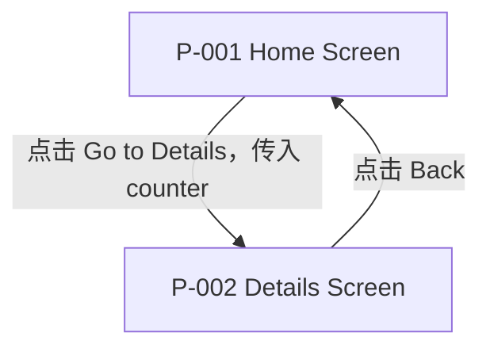
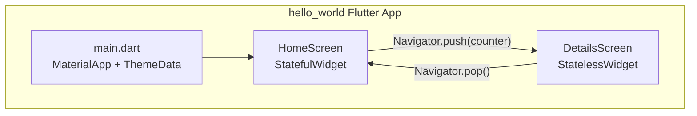

# PLAN-001: Hello World Flutter App

> updated_by: Kilo - GLM-5
> updated_at: 2026-04-20 11:21:17

## Requirements

本需求旨在创建一个 Hello World Flutter 演示应用，在当前项目环境下证明 Flutter 核心能力可正常运行，并为后续开发提供可参考的基础示例代码结构。当前仓库（`flutter-app`）尚无任何 Flutter 源代码，需要从零搭建演示工程。

### Goals

- **G-001 版本兼容验证**：目标版本组合在本机通过 `flutter doctor` 检查：
  - Flutter `3.29.3`
  - Java `17`
  - **被动版本**（由 Flutter 模板决定）：
    - Gradle `8.10.2`
    - AGP `8.7.0`
    - Kotlin `1.8.22`
- **G-002 调试能力**：在 Android Studio 中以 Debug 模式运行，可打断点并暂停
- **G-003 全流程跑通**：在本机跑通 `flutter create` → `flutter build apk` → `flutter run`（Android Emulator 或真机）
- **G-004 真机安装**：构建出独立 APK 文件，手动安装到 Android 真机上可正常启动

### Non-Goals

- 状态管理框架（Provider / Riverpod / BLoC 等）
- 后端接口或本地数据库集成
- 单元测试 / Widget 测试
- 多语言 / 国际化（i18n）
- 平台特定功能（相机、定位等）
- 生产级错误处理与日志

### Scope

- 在仓库根目录下创建名为 `hello_world` 的 Flutter 工程（`flutter create`）
- **Home Screen**：欢迎文字展示（Stateless Widget）
- **Details Screen**：接收来自 Home Screen 的参数并展示（Stateless Widget + `Navigator` 传参）
- 基础主题配置：`MaterialApp` + `ThemeData`（自定义 primary color）

### Non-Scope

- CI/CD 流水线配置
- iOS / Web / Desktop 编译验证（本计划仅验证 Android）
- 生产签名与发布
- 业务功能的完整性验收（计数器、导航等行为正确性留待后续子计划验证）

### Functional Requirements

#### 常规（Ubiquitous）需求

- **FR-001**: 系统应可通过 `flutter build apk` 编译为 Android APK 产物，且构建过程无报错。
- **FR-002**: 系统应可在 Android 设备或模拟器上通过 `flutter run` 启动，且启动后无崩溃。

#### 非期望行为（Unwanted Behavior）需求

- **FR-010**: 如果构建或运行过程出现版本不兼容错误，则系统不得静默忽略，应明确输出错误信息。

### Success Metrics

| Metric | Current | Target | How to Measure |
|--------|---------|--------|----------------|
| `flutter doctor` 无 [✗] 错误 | N/A | 通过 | 命令行输出 |
| `flutter build apk` 构建成功 | N/A | 产出 APK 文件 | 检查 `build/app/outputs/` 目录 |
| `flutter run` 在 Android 上启动无崩溃 | N/A | 通过 | 人工运行并观察 |
| APK 手动安装到真机可启动 | N/A | App 可启动无崩溃 | 人工安装并观察 |
| Android Studio Debug 断点可命中 | N/A | 断点暂停，可查看变量 | 人工操作验收 |

### Dependencies

- **D-001**: Flutter SDK 已安装（`flutter doctor` 无 [✗] 严重错误）
- **D-002**: 开发机上至少有一个可用的 Android 运行目标（Android Emulator 或真机）；真机系统版本待确定
- **D-003**: Android Studio 已安装并配置 Flutter / Dart 插件；版本待确定

### Constraints

- **C-001**: 目标平台为 Android（Emulator 或真机），不要求同时支持其他平台
- **C-002**: **主动版本**：Flutter 版本由项目约定固定为 `3.29.3`（见 Assumptions）
- **C-003**: **被动版本**：Gradle `8.10.2` / AGP `8.7.0` / Kotlin `1.8.22` 由 Flutter `3.29.3` 的模板自动生成
- **C-004**: 仅使用 Flutter 官方内置 Widget 与 Material 库，不引入第三方 package
- **C-005**: 每个 Dart 文件不超过 100 行，便于作为参考示例阅读

### Assumptions

- **A-001**: 使用 Flutter `3.29.3`；`flutter create` 默认模板使用 Material 3
- **A-002**: **被动版本**（预期值）：Gradle `8.10.2` / AGP `8.7.0` / Kotlin `1.8.22` 由 Flutter SDK 模板决定，通过 `flutter create` 后读取文件获得
- **A-003**: 项目根目录下允许创建 Flutter 工程（不使用子目录）

### References

- **REF-001**: Flutter 官方 Get Started Codelab — https://docs.flutter.dev/get-started/codelab

---

## Specs

- [ ] **SPEC-001**: Flutter 环境版本验证（→ G-001）
  - **背景 / 目标**: 确认本机目标版本组合完整且 `flutter doctor` 无严重错误，为后续构建提供前提保障
  - **范围**: 开发机环境检查，不涉及代码改动
  - **关键决策**: 以 `flutter doctor -v` 输出为验收依据；版本不符时需先对齐环境再继续
  - **实现约束**:
    - 不修改任何代码，仅做环境检查
  - **接口 / 对接点**: N/A
  - **命令 / 操作**: `flutter doctor -v`
  - **验收（勾选即证据）**:
    - [ ] `flutter doctor` 无 [✗] 错误
    - [ ] Flutter 版本为 `3.29.3`
    - [ ] Java 版本为 `17`
    - [ ] 被动版本（预期）：Gradle `8.10.2` / AGP `8.7.0` / Kotlin `1.8.22`

- [ ] **SPEC-002**: **版本锁定规范**
  - 所有版本声明禁止使用范围版本符号（`^`、`>=`、`~`等）
  - 必须使用精确版本号，如 `sdk: 3.7.2` 而非 `sdk: ^3.7.2`
  - 适用于 `pubspec.yaml` 中所有依赖版本声明

- [ ] **SPEC-003**: Android Studio Debug 配置验证（→ G-002）
  - **背景 / 目标**: 验证 Android Studio 可识别 Flutter 工程并以 Debug 模式运行，断点可命中
  - **范围**: Android Studio 配置 + Flutter / Dart 插件；不修改 Flutter 工程代码
  - **关键决策**: 使用 Android Studio 内置 Run/Debug 功能配合 Flutter 插件；断点打在 Dart 代码中
  - **实现约束**:
    - Android Studio 版本待确定，确认后补录
  - **接口 / 对接点**: Android Studio → Flutter 工程 → Android Emulator 或真机
  - **命令 / 操作**: 在 Android Studio 中点击 Debug 按钮运行
  - **验收（勾选即证据）**:
    - [ ] Android Studio 可识别 `hello_world/` 为 Flutter 工程
    - [ ] Debug 模式可启动，App 在设备上运行
    - [ ] 在 Dart 代码中打断点，程序可暂停并在 IDE 中查看变量值

- [ ] **SPEC-004**: Flutter 工程初始化与 APK 构建（→ G-003）
  - **背景 / 目标**: 从零创建 Flutter 工程，跑通 `flutter create` → `flutter build apk` → `flutter run` 全流程
  - **范围**: `hello_world/` 工程目录；`lib/main.dart` 替换为最简 Hello World 实现
  - **关键决策**: 使用 `flutter create --platforms android --org com.lisitede.preset --project-name preset .`（在当前目录创建，仅 Android）；`lib/main.dart` 仅保留 `MaterialApp` + 一个 Stateless Widget 展示欢迎文字，不引入第三方依赖
  - **实现约束**:
    - 不添加第三方 package
    - `lib/main.dart` 不超过 40 行
  - **接口 / 对接点**: N/A
  - **命令 / 操作**:
    - `flutter create --platforms android --org com.lisitede.preset --project-name preset .`
    - `flutter build apk`
    - `flutter run`
  - **验收（勾选即证据）**:
    - [ ] `flutter create` 成功生成工程，无报错
    - [ ] `flutter build apk` 成功，产出 APK 文件（`build/app/outputs/flutter-apk/app-debug.apk`）
    - [ ] `flutter run` 在 Android Emulator 或真机上启动，App 界面可见且无崩溃

- [ ] **SPEC-005**: 独立 APK 真机安装验证（→ G-004）
  - **背景 / 目标**: 验证 SPEC-003 产出的 APK 可手动安装到 Android 真机并独立运行
  - **范围**: SPEC-003 产出的 `app-debug.apk`；真机系统版本待确定
  - **关键决策**: 通过 `adb install` 或文件传输手动安装，不依赖 `flutter run`
  - **实现约束**:
    - 真机需开启「允许未知来源安装」或通过 ADB 安装
  - **接口 / 对接点**: APK 文件 → Android 真机
  - **命令 / 操作**: `adb install build/app/outputs/flutter-apk/app-debug.apk`
  - **验收（勾选即证据）**:
    - [ ] ADB 安装命令执行成功，无兼容性错误
    - [ ] 真机桌面出现 App 图标
    - [ ] 点击图标可正常启动，App 界面可见且无崩溃

---

## Design

### 应用定位

纯演示型 Hello World，聚焦于证明 Flutter 核心概念在本地环境可运行，无业务逻辑复杂性。

### Page & Component Inventory

#### 页面清单（2 个页面）

- **P-001 Home Screen**
  - **路由**: `/`（`initialRoute`，App 启动默认页）
  - **入口**: App 启动
  - **用户与权限**: 无鉴权
  - **核心区块（页面级组件）**:
    - AppBar（标题「Hello Flutter」）
    - 中央计数展示区（`Text`，大字号）
    - FloatingActionButton（图标 `add`，+1）
    - 「Go to Details」按钮（`ElevatedButton`）
  - **关键状态**: `_counter`（int，初始 0；由 `setState` 驱动更新）
  - **对接点**: `Navigator.push` → P-002，传递 `_counter` 当前值
  - **埋点/监控**: N/A

- **P-002 Details Screen**
  - **路由**: 无命名路由，通过 `Navigator.push` 进入
  - **入口**: P-001「Go to Details」按钮
  - **用户与权限**: 无鉴权
  - **核心区块（页面级组件）**:
    - AppBar（标题「Details」，含自动生成的 Back 按钮）
    - 计数值展示区（`Text`：「You pressed the button X times.」）
  - **关键状态**: 无（Stateless）；`counter` 通过构造函数注入，不可变
  - **对接点**: 接收 `int counter`；`Navigator.pop()` 由 AppBar Back 自动触发
  - **埋点/监控**: N/A

#### 页面流向图



### Architecture Overview



### 文件结构

```
hello_world/
├── lib/
│   ├── main.dart                   # App 入口 + MaterialApp + 主题
│   └── screens/
│       ├── home_screen.dart        # P-001 Home Screen
│       └── details_screen.dart     # P-002 Details Screen
├── pubspec.yaml                    # 无第三方依赖
└── ...（flutter create 其余文件）
```

### 版本锁定规范

- 所有 `pubspec.yaml` 依赖版本必须精确锁定，禁止使用范围版本符号（`^`、`>=`、`~`等）
- 参见 SPEC-002

---

## Phases

### 执行模式

- **MUST** 严格按顺序执行，从第一个 `- [ ]` 开始，一次只执行一个 Task。
- **MUST** 完成 Task 后将对应条目从 `- [ ]` 更新为 `- [x]`。
- **MUST** 发生错误时立即停止，等待人工指示。
- **MUST NOT** 跳过任务，不执行任务列表之外的工作。

### 概览

| Phase | Tasks | Completed | Progress |
|-------|-------|-----------|----------|
| PHASE-100 环境验证 | 2 | 0 | 0% |
| PHASE-200 核心页面实现 | 4 | 0 | 0% |
| PHASE-300 收尾对齐 | 1 | 0 | 0% |
| **Total** | **7** | **0** | **0%** |

### PHASE-100: 环境验证与工程初始化

本 Phase 聚焦于从零创建 Flutter 工程，验证开发环境与默认模板可正常运行，为后续页面实现提供基础。

- [ ] **TASK-001**: 在当前目录执行 `flutter create --platforms android --org com.lisitede.preset --project-name preset .`，确认工程文件生成无误
  - **Complexity**: Low
  - **Files**: `hello_world/`（整个工程目录，由工具生成）
  - **Dependencies**: D-001（Flutter SDK 可用）、D-002（存在运行目标）
  - **Notes**: 执行前确认 `flutter doctor` 无 [✗] 严重错误；生成后不做任何修改，保持默认状态。

- [ ] **TASK-002**: 执行 `flutter run` 验证默认计数器模板可正常启动 **【人工验收】**
  - **Complexity**: Low
  - **Files**: N/A
  - **Dependencies**: TASK-001
  - **Notes**: 验收点：① App 启动无崩溃；② 默认计数器界面可见；③ 点击 FAB 计数递增。

### PHASE-200: 核心页面实现

本 Phase 基于 SPEC-001～004，替换默认模板，实现 Home Screen + Details Screen + 主题配置。

- [ ] **TASK-100**: 重构 `main.dart`：配置 `MaterialApp`、`ThemeData`，入口指向新建的 `HomeScreen`
  - **Complexity**: Low
  - **Files**: `hello_world/lib/main.dart`
  - **Dependencies**: TASK-002
  - **Notes**: 删除默认注释块；`theme` 使用 `ColorScheme.fromSeed(seedColor: Colors.deepPurple)`；文件 < 40 行。

- [ ] **TASK-101**: 新建 `lib/screens/home_screen.dart`，实现 HomeScreen（Stateful Widget + 计数器 + 导航按钮）
  - **Complexity**: Low
  - **Files**: `hello_world/lib/screens/home_screen.dart`
  - **Dependencies**: TASK-100
  - **Notes**: `_counter` 初始为 0；FAB `onPressed` 调用 `setState(() => _counter++)`；ElevatedButton「Go to Details」调用 `Navigator.push` 并传入 `_counter`。

- [ ] **TASK-102**: 新建 `lib/screens/details_screen.dart`，实现 DetailsScreen（Stateless Widget，展示传入 counter）
  - **Complexity**: Low
  - **Files**: `hello_world/lib/screens/details_screen.dart`
  - **Dependencies**: TASK-101
  - **Notes**: 构造函数 `const DetailsScreen({super.key, required this.counter})`；Body 展示「You pressed the button $counter times.」；Back 由 AppBar 自动提供，无需手动处理。

- [ ] **TASK-199**: 人工验收 PHASE-200 **【人工验收】**
  - **Complexity**: Low
  - **Files**: N/A
  - **Dependencies**: TASK-102
  - **Notes**: 验收点：① `flutter run` 无报错；② Home Screen AppBar 显示「Hello Flutter」；③ 点击 FAB 三次后计数显示 3；④ 点击「Go to Details」跳转，Details Screen 显示「3 times」；⑤ Back 返回 Home Screen，计数保持 3。

### PHASE-300: 收尾对齐

- [ ] **TASK-300**: 确认全部 SPEC 验收点已勾选，更新本 Plan 文件状态 **【人工验收】**
  - **Complexity**: Low
  - **Files**: `.plans/PLAN-001-hello-world.md`
  - **Dependencies**: TASK-199
  - **Notes**: 将已完成的 SPEC 验收 checkbox 全部勾选；如发现不一致则返回对应 Phase 补齐后再收尾。

---

<!-- // 以下留空 -->

---

## PHASE-100: 环境验证与工程初始化

### Relevant Requirements

- **G-001**: Flutter `3.29.3` / Java `17` / 被动版本（Gradle `8.10.2` / AGP `8.7.0` / Kotlin `1.8.22`）目标版本组合在本机通过 `flutter doctor` 检查
- **G-003**: 在本机跑通 `flutter create` → `flutter build apk` → `flutter run`（Android Emulator 或真机）
- **FR-001**: 系统应可通过 `flutter build apk` 编译为 Android APK 产物，且构建过程无报错
- **FR-002**: 系统应可在 Android 设备或模拟器上通过 `flutter run` 启动，且启动后无崩溃
- **D-001**: Flutter SDK 已安装（`flutter doctor` 无 [✗] 严重错误）
- **D-002**: 开发机上至少有一个可用的 Android 运行目标
- **C-002**: **主动版本**：Flutter `3.29.3`；**被动版本**：Gradle `8.10.2` / AGP `8.7.0` / Kotlin `1.8.22`
- **A-002**: 被动版本不主动指定，通过 `flutter create` 后读取文件获得

### Relevant Specs

- **SPEC-001**: Flutter 环境版本验证（→ G-001）
  - 以 `flutter doctor -v` 输出为验收依据；版本不符时需先对齐环境再继续
- **SPEC-003**（初始化部分）: Flutter 工程初始化（→ G-003）
  - 使用 `flutter create --platforms android --org com.lisitede.preset --project-name preset .`（在当前目录创建，仅 Android）；保持默认模板，不做任何修改

### Relevant Design

- 文件结构：在仓库根目录创建 Flutter 工程
- 本 Phase 不涉及页面实现，使用 `flutter create` 默认模板

### Tasks Breakdown

- [x] **TASK-100**: 执行 `flutter doctor -v` 验证环境版本
  - **Dependencies**:
    - None
  - **Do**:
    - [x] 执行 `flutter doctor -v` -> 输出日志写入 `.context/current-task.md`
  - **Check**:
    - [x] 无 [✗] 严重错误
    - [x] Flutter 版本 = `3.29.3`
    - [x] Java 版本 = `17`
  - **Act**:
    - SUCCESS: Success and Continue

- [x] **TASK-120**: 执行 `flutter create` 初始化工程 + 提取被动版本
- **Dependencies**:
    - TASK-100
  - **Do**:
    - [x] 执行 `flutter create --platforms android --org com.lisitede.preset --project-name preset .` -> 在当前目录创建工程
    - [x] 通过 `where flutter` 命令找到 Flutter SDK 目录
    - [x] 读取 `flutter\packages\flutter_tools\lib\src\android\gradle_utils.dart` 提取模板默认值
    - [x] 读取生成文件中的实际版本并与模板值对比
    - [x] 将 AGP / Gradle / Kotlin 版本回填到 `.context/current-task.md`
    - [x] 锁定 `pubspec.yaml` 所有版本（去掉 `^` 符号）
  - **Check**:
    - [x] 命令退出码为 0，无报错输出
    - [x] 模板默认版本已提取并记录
    - [x] 生成文件中的实际版本已记录
    - [x] 版本差异已标记（如有）
    - [x] `pubspec.yaml` 所有版本已锁定（无 `^` 范围符号）
  - **Act**:
    - SUCCESS: Success and Continue → TASK-130

- [ ] **TASK-130**: 执行 `flutter build apk` 验证构建
  - **Dependencies**:
    - TASK-120
  - **Do**:
    - [ ] 在当前目录执行 `flutter build apk` -> `build/app/outputs/flutter-apk/app-debug.apk`
  - **Check**:
    - [ ] 命令退出码为 0，无报错输出
    - [ ] `app-debug.apk` 文件存在
    - [ ] 构建日志中 AGP / Gradle / Kotlin 版本可确认（与 TASK-120 提取值一致）
  - **Act**:
    - IF  SUCCESS: 将 Act 更新为 Success and Continue
    - ELIF FAILED: 将 Act 更新为 FAILED and Handoff；立即停止执行，并报告失败原因、阻塞点、需要人工确认的决策点

- [ ] **TASK-140**: 执行 `flutter run` 验证默认模板启动 **【人工验收】**
  - **Dependencies**:
    - TASK-130
  - **Do**:
    - [ ] 执行 `flutter run`，选择可用 Android 目标 -> App 在设备上运行
  - **Check**:
    - [ ] App 启动无崩溃
    - [ ] 默认计数器界面可见
    - [ ] 点击 FAB 计数递增
  - **Act**:
    - IF  SUCCESS: 将 Act 更新为 Success and Continue
    - ELIF FAILED: 将 Act 更新为 FAILED and Handoff；立即停止执行，并报告失败原因、阻塞点、需要人工确认的决策点

---
<!-- // 注意 Phase 的头尾要保留分割线 -->
---

## PHASE-200: 核心插件集成验证

> updated_by: Kilo - GLM-5
> updated_at: 2026-04-22 19:56:00

### Relevant Requirements

- **G-003**: 在本机跑通 `flutter create` → `flutter build apk` → `flutter run`（Android Emulator 或真机）
- **G-004**: 真机安装：构建出独立 APK 文件，手动安装到 Android 真机上可正常启动
- **FR-001**: 系统应可通过 `flutter build apk` 编译为 Android APK 产物，且构建过程无报错
- **FR-002**: 系统应可在 Android 设备或模拟器上通过 `flutter run` 启动，且启动后无崩溃
- **C-004**: 仅使用 Flutter 官方内置 Widget 与 Material 库，不引入第三方 package（本 Phase 例外，引入验证目标插件）

### 基础版本约束（插件必须兼容）

**所有新增插件必须满足以下版本兼容性要求，不得引入版本冲突：**

| 版本项 | 当前项目版本 | 插件要求 | 来源文件 |
|--------|--------------|----------|----------|
| Flutter SDK | `3.29.3` | ≥ `3.29.3` 或兼容 | `.context/current-task.md` TASK-100 验证结果 |
| Dart SDK | `3.7.2` | ≥ `3.7.2` 或兼容 | `pubspec.yaml:22` |
| AGP (Android Gradle Plugin) | `8.7.0` | 兼容 `8.7.0` | `android/settings.gradle.kts:24` |
| Kotlin | `1.8.22` | 兼容 `1.8.22` | `android/settings.gradle.kts:25` |
| Java | `17` | 兼容 `17` | `android/app/build.gradle.kts:14-15` |
| Android minSdk | `21` | ≤ `21` 或兼容 | `android/app/build.gradle.kts:27`（flutter.minSdkVersion） |
| Android targetSdk | `35` | ≤ `35` 或兼容 | `android/app/build.gradle.kts:28`（flutter.targetSdkVersion） |
| Android compileSdk | 动态值 | 由 Flutter SDK 决定 | `android/app/build.gradle.kts:10`（flutter.compileSdkVersion） |

**兼容性检查要点：**
- 插件的 `pubspec.yaml` 中 `environment.sdk` 必须 ≤ `3.7.2` 或使用范围版本兼容 `3.7.2`
- 插件的 Android 原生部分（如有）不得要求更高 Kotlin/AGP 版本
- 插件的 Android 原生部分（如有）不得要求 minSdk > `21`
- 插件不得引入与现有依赖冲突的版本

### Relevant Specs

- **SPEC-002**: 版本锁定规范（所有版本声明禁止使用范围版本符号）
- **SPEC-004**: Flutter 工程初始化与 APK 构建（→ G-003）

### Relevant Design

本 Phase 不涉及页面设计，重点验证以下插件的集成与功能：

1. **connectivity_plus**: 网络连接状态检测
2. **device_info_plus**: 设备信息获取
3. **package_info_plus**: 应用包信息
4. **webview_flutter**: WebView 组件

### Tasks Breakdown

- [x] **TASK-100**: 添加 connectivity_plus 插件并验证网络状态检测 **【人工验收通过】**
  - **Dependencies**:
    - PHASE-100/TASK-130 (APK 构建验证)
  - **Version Constraints**:
    - Flutter SDK: `3.29.3` ✓
    - Dart SDK: `3.7.2` ✓
    - Kotlin: `1.8.22` ✓
    - AGP: `8.7.0` ✓
    - Android minSdk: `21` ✓
    - Java: `17` ✓
    - Gradle: `8.10.2` ✓
  - **Do**:
    - 检查 connectivity_plus 的 pub.dev 页面，确认版本兼容性 -> 记录兼容版本范围
    - 执行 `flutter pub add connectivity_plus` 安装插件 -> 更新 `pubspec.yaml`
    - 锁定版本号（去掉 `^` 符号） -> 确保 SPEC-002 合规
    - 检查插件是否有 Android 原生依赖冲突 -> 查看 `pubspec.yaml` 和 `android/build.gradle` 变化
    - 在 `lib/main.dart` 中添加测试代码，显示网络连接状态 -> 控制台输出网络类型
    - 执行 `flutter run` 在设备上测试 -> 观察网络状态变化
    - 将验证结果写入 `.context/current-task.md` → Connectivity Plus 验证章节
  - **Check**:
    - [x] connectivity_plus 版本与 Flutter SDK `3.29.3` 兼容（6.0.5 要求 >= 3.7.0）
    - [x] connectivity_plus 版本与 Dart SDK `3.7.2` 兼容（6.0.5 要求 >= 3.2.0 < 4.0.0）
    - [x] connectivity_plus 版本与 Kotlin `1.8.22` 兼容（无明确 Kotlin 要求）
    - [x] connectivity_plus 版本与 AGP `8.7.0` 兼容（6.0.5 要求 AGP >= 8.3.0）
    - [x] connectivity_plus 版本与 Android minSdk `21` 兼容（插件 minSdk 19）
    - [x] connectivity_plus 版本与 Java `17` 兼容（6.0.5 要求 Java 17）
    - [x] connectivity_plus 版本与 Gradle `8.10.2` 兼容（6.0.5 要求 Gradle >= 8.4）
    - [x] `pubspec.yaml` 中 `connectivity_plus` 版本已锁定
    - [x] `flutter run` 无报错
    - [x] 控制台输出网络连接类型（WiFi/Cellular/None）
    - [x] 切换网络状态时能检测到变化
  - **Note**: NDK 版本警告存在但不阻止编译和运行
  - **Act**:
    - SUCCESS: Success and Continue

- [ ] **TASK-110**: 添加 device_info_plus 插件并验证设备信息获取
  - **Dependencies**:
    - TASK-100 (connectivity_plus 插件验证)
  - **Version Constraints**:
    - Flutter SDK: `3.29.3` ✓
    - Dart SDK: `3.7.2` ✓
    - Kotlin: `1.8.22` ✓
    - AGP: `8.7.0` ✓
    - Android minSdk: `21` ✓
  - **Do**:
    - 检查 device_info_plus 的 pub.dev 页面，确认版本兼容性 -> 记录兼容版本范围
    - 执行 `flutter pub add device_info_plus` 安装插件 -> 更新 `pubspec.yaml`
    - 锁定版本号（去掉 `^` 符号） -> 确保 SPEC-002 合规
    - 检查插件是否有 Android 原生依赖冲突 -> 查看 `pubspec.yaml` 和 `android/build.gradle` 变化
    - 在 `lib/main.dart` 中添加测试代码，读取并显示设备信息 -> 控制台输出设备型号、系统版本等
    - 执行 `flutter run` 在设备上测试 -> 验证信息获取正确性
    - 将验证结果写入 `.context/current-task.md` → Device Info Plus 验证章节
  - **Check**:
    - [ ] device_info_plus 版本与 Flutter SDK `3.29.3` 兼容
    - [ ] device_info_plus 版本与 Dart SDK `3.7.2` 兼容
    - [ ] device_info_plus 版本与 Kotlin `1.8.22` 兼容（如有原生部分）
    - [ ] device_info_plus 版本与 AGP `8.7.0` 兼容（如有原生部分）
    - [ ] device_info_plus 版本与 Android minSdk `21` 兼容
    - [ ] `pubspec.yaml` 中 `device_info_plus` 版本已锁定
    - [ ] `flutter run` 无报错
    - [ ] 控制台输出 Android 设备信息（brand、model、androidVersion 等）
    - [ ] 信息内容与真机/模拟器一致
  - **Act**:
    - IF SUCCESS: 将 Act 更新为 Success and Continue
    - ELIF FAILED: 将 Act 更新为 FAILED and Handoff；立即停止执行，并报告失败原因、阻塞点、需要人工确认的决策点

- [ ] **TASK-120**: 添加 package_info_plus 插件并验证应用包信息获取
  - **Dependencies**:
    - TASK-110 (device_info_plus 插件验证)
  - **Version Constraints**:
    - Flutter SDK: `3.29.3` ✓
    - Dart SDK: `3.7.2` ✓
    - Kotlin: `1.8.22` ✓
    - AGP: `8.7.0` ✓
    - Android minSdk: `21` ✓
  - **Do**:
    - 检查 package_info_plus 的 pub.dev 页面，确认版本兼容性 -> 记录兼容版本范围
    - 执行 `flutter pub add package_info_plus` 安装插件 -> 更新 `pubspec.yaml`
    - 锁定版本号（去掉 `^` 符号） -> 确保 SPEC-002 合规
    - 检查插件是否有 Android 原生依赖冲突 -> 查看 `pubspec.yaml` 和 `android/build.gradle` 变化
    - 在 `lib/main.dart` 中添加测试代码，读取并显示应用包信息 -> 控制台输出应用名称、版本号、构建号
    - 执行 `flutter run` 在设备上测试 -> 验证信息获取正确性
    - 将验证结果写入 `.context/current-task.md` → Package Info Plus 验证章节
  - **Check**:
    - [ ] package_info_plus 版本与 Flutter SDK `3.29.3` 兼容
    - [ ] package_info_plus 版本与 Dart SDK `3.7.2` 兼容
    - [ ] package_info_plus 版本与 Kotlin `1.8.22` 兼容（如有原生部分）
    - [ ] package_info_plus 版本与 AGP `8.7.0` 兼容（如有原生部分）
    - [ ] package_info_plus 版本与 Android minSdk `21` 兼容
    - [ ] `pubspec.yaml` 中 `package_info_plus` 版本已锁定
    - [ ] `flutter run` 无报错
    - [ ] 控制台输出应用包信息（appName、version、buildNumber）
    - [ ] 信息内容与 `pubspec.yaml` 一致
  - **Act**:
    - IF SUCCESS: 将 Act 更新为 Success and Continue
    - ELIF FAILED: 将 Act 更新为 FAILED and Handoff；立即停止执行，并报告失败原因、阻塞点、需要人工确认的决策点

- [ ] **TASK-130**: 添加 webview_flutter 插件并验证 WebView 组件
  - **Dependencies**:
    - TASK-120 (package_info_plus 插件验证)
  - **Version Constraints**:
    - Flutter SDK: `3.29.3` ✓
    - Dart SDK: `3.7.2` ✓
    - Kotlin: `1.8.22` ✓
    - AGP: `8.7.0` ✓
    - Android minSdk: `21` ✓
  - **Do**:
    - 检查 webview_flutter 的 pub.dev 页面，确认版本兼容性 -> 记录兼容版本范围
    - 执行 `flutter pub add webview_flutter` 安装插件 -> 更新 `pubspec.yaml`
    - 锁定版本号（去掉 `^` 符号） -> 确保 SPEC-002 合规
    - 检查插件是否有 Android 原生依赖冲突 -> 查看 `pubspec.yaml` 和 `android/build.gradle` 变化
    - 在 `lib/main.dart` 中添加测试代码，加载简单网页（如 `https://flutter.dev`） -> WebView 显示网页内容
    - 配置 Android 网络权限（如需要） -> `android/app/src/main/AndroidManifest.xml`
    - 执行 `flutter run` 在设备上测试 -> 验证网页加载正确性
    - 将验证结果写入 `.context/current-task.md` → WebView Flutter 验证章节
  - **Check**:
    - [ ] webview_flutter 版本与 Flutter SDK `3.29.3` 兼容
    - [ ] webview_flutter 版本与 Dart SDK `3.7.2` 兼容
    - [ ] webview_flutter 版本与 Kotlin `1.8.22` 兼容（如有原生部分）
    - [ ] webview_flutter 版本与 AGP `8.7.0` 兼容（如有原生部分）
    - [ ] webview_flutter 版本与 Android minSdk `21` 兼容
    - [ ] `pubspec.yaml` 中 `webview_flutter` 版本已锁定
    - [ ] Android 网络权限已配置（`INTERNET` permission）
    - [ ] `flutter run` 无报错
    - [ ] WebView 正常加载网页（能显示内容）
    - [ ] 页面可滚动、交互正常
  - **Act**:
    - IF SUCCESS: 将 Act 更新为 Success and Continue
    - ELIF FAILED: 将 Act 更新为 FAILED and Handoff；立即停止执行，并报告失败原因、阻塞点、需要人工确认的决策点

- [ ] **TASK-140**: 整理验证代码并构建最终 APK **【人工验收】**
  - **Dependencies**:
    - TASK-130 (webview_flutter 插件验证)
  - **Version Constraints**:
    - 确认所有插件版本无冲突 ✓
    - 确认所有插件与基础版本兼容 ✓
  - **Do**:
    - 清理 `lib/main.dart` 中的测试代码，保留各插件的基础验证示例 -> 代码整洁可读
    - 执行 `flutter build apk --release` 构建最终 APK -> `build/app/outputs/flutter-apk/app-release.apk`
    - 在真机上手动安装并测试所有插件功能 -> 验证每个功能正常工作
    - 将最终验证结果写入 `.context/current-task.md` → 最终验收章节
  - **Check**:
    - [ ] 所有插件版本锁定，无范围符号
    - [ ] 所有插件与基础版本兼容，无冲突
    - [ ] `lib/main.dart` 代码整洁，包含四个插件的基础示例
    - [ ] Release APK 构建成功
    - [ ] 真机安装成功，无崩溃
    - [ ] 网络状态检测正常
    - [ ] 设备信息获取正确
    - [ ] 应用包信息读取正确
    - [ ] WebView 加载网页正常
  - **Act**:
    - IF SUCCESS: 将 Act 更新为 Success and Continue
    - ELIF FAILED: 将 Act 更新为 FAILED and Handoff；立即停止执行，并报告失败原因、阻塞点、需要人工确认的决策点

---
<!-- // 注意 Phase 的头尾要保留分割线 -->