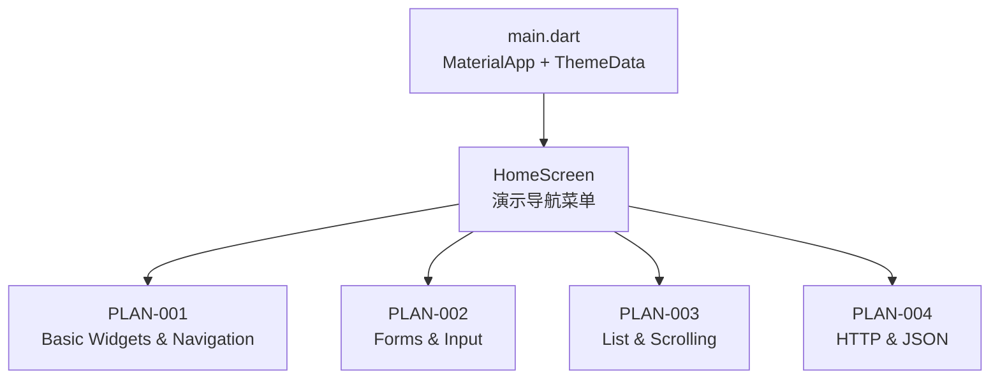
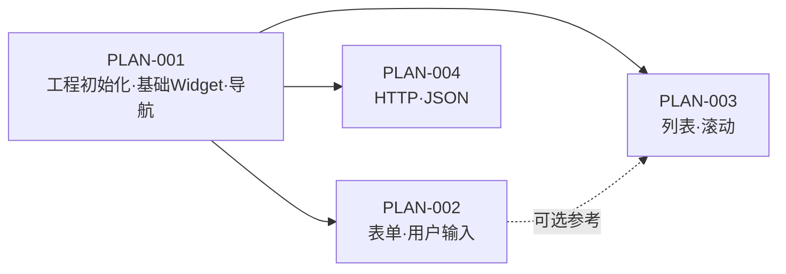

# PLAN-000: Hello World Flutter App — Vision

> updated_by: Cascade - Claude Sonnet 4.5
> updated_at: 2026-04-16 11:59:00

## Requirements

本 Vision 文档是 Hello World Flutter App 的顶层计划，统筹整体目标、范围与子计划划分。目标是通过一系列递进的演示页面，在真实设备/模拟器上证明 Flutter 核心能力可正常运行，并为团队后续项目提供可参考的基础示例代码库。

### Goals

- 搭建一个可运行的 Flutter 演示工程，覆盖 Flutter 开发的核心基础能力
- 每个子计划独立可验收，演示一个或一组相关概念，形成可积累的知识示例
- 所有示例代码保持简洁（单文件 ≤ 100 行），便于作为参考模板复用

### Non-Goals

- 生产级应用（不含鉴权、后台服务、CI/CD、多语言等）
- 状态管理框架深度集成（Provider / Riverpod / BLoC 等超出演示范围）
- 性能优化与生产发布

### Scope

- **PLAN-001**：工程初始化 · 基础 Widget · 导航（StatefulWidget、setState、Navigator 传参、主题）
- **PLAN-002**：表单 · 用户输入 · 表单校验（TextField、Form、TextFormField、GlobalKey）
- **PLAN-003**：列表 · 滚动 · 动态数据（ListView、ListTile、动态增删）
- **PLAN-004**：HTTP 网络请求 · JSON 解析（`http` package、FutureBuilder、错误处理）

### Non-Scope

- 单元测试 / Widget 测试（各子计划内仅人工验收）
- iOS / Web / Desktop 多平台同时验证
- 数据库 / 本地持久化（超出本次基础演示范围）

### Functional Requirements

#### 常规（Ubiquitous）需求

- **FR-001**: 系统应在 Android 或 Flutter Desktop 上可启动并运行所有演示页面。
- **FR-002**: 系统应在统一的 Flutter 工程（`hello_world/`）内组织所有子计划的演示页面。
- **FR-003**: 系统应在 Home Screen 提供导航入口，可进入每个演示模块。

#### 事件驱动（Event-Driven）需求

- **FR-010**: 当某子计划演示完成并人工验收通过时，对应 Plan 文件中的验收 checkbox 应标记为完成。

### Success Metrics

| Metric | Current | Target | How to Measure |
|--------|---------|--------|----------------|
| 子计划全部通过人工验收 | 0 / 4 | 4 / 4 | 各 Plan 文件 SPEC 验收点全部勾选 |
| 统一工程可启动 | N/A | 通过 | `flutter run` 无报错 |

### Dependencies

- **D-001**: Flutter SDK >= 3.0 已安装，`flutter doctor` 无严重错误
- **D-002**: 开发机上存在可用运行目标（Android Emulator / Device 或 Flutter Desktop）

### Constraints

- **C-001**: 所有子计划均在同一个 Flutter 工程（`hello_world/`）内实现，共享 `pubspec.yaml`
- **C-002**: 各子计划引入的第三方 package 需在本文档 Dependencies 中统一记录
- **C-003**: 子计划按顺序推进；后序子计划可依赖前序已有代码结构

### Assumptions

- **A-001**: 团队以"逐步推进"方式完成各子计划，不要求同时并行实现
- **A-002**: 每个子计划完成后，对应示例代码长期保留在工程内作为参考

---

## Specs

- [ ] **SPEC-000**: 工程顶层导航入口（Home Screen 演示菜单）
  - **背景 / 目标**: 统一的 Home Screen 提供进入各子计划演示页面的入口，避免每次运行只能看到一个演示
  - **范围**: `lib/main.dart` + `lib/screens/home_screen.dart`（随子计划推进迭代）
  - **关键决策**: Home Screen 使用 `ListView` 列出所有演示入口；每个入口对应一个 `ListTile`，点击跳转到对应演示页；随子计划推进逐步追加入口，不一次性全部实现
  - **实现约束**:
    - Home Screen 始终是 `initialRoute`
    - 各演示页面通过 `Navigator.push` 进入，保持独立
  - **接口 / 对接点**: 各子计划的演示 Screen 挂载到 Home Screen 导航菜单
  - **命令 / 操作**: N/A
  - **验收（勾选即证据）**:
    - [ ] Home Screen 显示所有已实现演示的入口列表
    - [ ] 点击任意入口可正常跳转

---

## Design

### 整体架构



### 文件结构（目标态）

```
hello_world/
├── lib/
│   ├── main.dart
│   └── screens/
│       ├── home_screen.dart          # 演示导航菜单（随子计划迭代）
│       ├── basic/                    # PLAN-001
│       │   ├── counter_screen.dart
│       │   └── details_screen.dart
│       ├── forms/                    # PLAN-002
│       │   └── form_demo_screen.dart
│       ├── lists/                    # PLAN-003
│       │   └── list_demo_screen.dart
│       └── network/                  # PLAN-004
│           └── network_demo_screen.dart
├── pubspec.yaml
└── ...
```

### 子计划依赖关系



> **说明**：PLAN-002 / 003 / 004 均依赖 PLAN-001 完成（工程已初始化），三者之间无强依赖，可独立推进；建议按序完成以保持代码结构一致。

---

## Phases

### 执行模式

- 每个 Phase 对应一个子计划（独立 Plan 文件）；Phase 完成即子计划人工验收通过。
- **MUST** 严格按顺序推进，前序 Phase 人工验收通过后方可开始下一 Phase。
- **MUST NOT** 同时并行推进多个子计划（避免工程冲突）。

### 概览

| Phase | 子计划 | Status |
|-------|--------|--------|
| PHASE-001 | [PLAN-001](./PLAN-001-Hello-World.md) 工程初始化 · 基础 Widget · 导航 | 🔵 进行中 |
| PHASE-002 | [PLAN-002](./PLAN-002-forms.md) 表单 · 用户输入 · 表单校验 | ⬜ 待规划 |
| PHASE-003 | [PLAN-003](./PLAN-003-lists.md) 列表 · 滚动 · 动态数据 | ⬜ 待规划 |
| PHASE-004 | [PLAN-004](./PLAN-004-network.md) HTTP 网络请求 · JSON 解析 | ⬜ 待规划 |

### PHASE-001: 工程初始化 · 基础 Widget · 导航

→ 详见 **[PLAN-001-Hello-World.md](./PLAN-001-Hello-World.md)**

本 Phase 从零搭建 Flutter 工程，演示 Stateful / Stateless Widget、`setState` 计数器、`Navigator` 页面传参、`MaterialApp` 主题配置。

**进入条件**: Flutter SDK 可用（`flutter doctor` 无严重错误）

**退出条件（人工验收）**:
- [ ] `flutter run` 启动无报错
- [ ] 计数器点击 3 次显示 3
- [ ] Details Screen 正确展示传入的计数值，Back 可返回

### PHASE-002: 表单 · 用户输入 · 表单校验

→ 详见 **[PLAN-002-forms.md](./PLAN-002-forms.md)**（待规划）

本 Phase 演示 `Form`、`TextFormField`、`GlobalKey<FormState>`、客户端校验逻辑。

**进入条件**: PHASE-001 人工验收通过

**退出条件（人工验收）**:
- [ ] 表单提交时触发校验，不合法时展示错误提示
- [ ] 表单提交成功后展示提交内容

### PHASE-003: 列表 · 滚动 · 动态数据

→ 详见 **[PLAN-003-lists.md](./PLAN-003-lists.md)**（待规划）

本 Phase 演示 `ListView.builder`、动态增删列表项、`ListTile`、`Dismissible`。

**进入条件**: PHASE-001 人工验收通过

**退出条件（人工验收）**:
- [ ] 列表可动态增加条目
- [ ] 可滑动删除条目

### PHASE-004: HTTP 网络请求 · JSON 解析

→ 详见 **[PLAN-004-network.md](./PLAN-004-network.md)**（待规划）

本 Phase 演示 `http` package、`FutureBuilder`、JSON 解析与错误处理。

**进入条件**: PHASE-001 人工验收通过

**退出条件（人工验收）**:
- [ ] 成功发起 HTTP GET 请求并展示返回数据
- [ ] 网络错误时展示错误提示

---

<!-- // 以下留空 -->